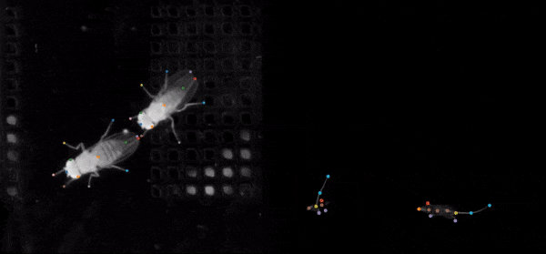

# SLEAP App

<div class="hero" markdown>

</div>

<div class="badges" markdown>
[](https://github.com/talmolab/sleap-app/releases/)
[](https://github.com/talmolab/sleap-app)
[](https://github.com/talmolab/sleap-app/blob/main/LICENSE)
</div>

**SLEAP App** is the labeling, training, and tracking interface for
[SLEAP](https://sleap.ai) — a modern rewrite of SLEAP's Qt/Python desktop GUI as a
web app, with an optional desktop shell for native file access.

It runs **entirely in your browser** — no server, no Python, no install — or as a
**~5 MB desktop app** when you want native file dialogs, local GPU training, and
offline use.

<div class="grid cards" markdown>

-   🌐 **Use it right now**

    ---

    Open a `.slp` file and start labeling. Nothing to install.

    [:octicons-arrow-right-24: app.sleap.ai](https://app.sleap.ai)

-   💻 **Install the desktop app**

    ---

    Native file access, local training, and in-app updates.

    [:octicons-arrow-right-24: Installation](installation.md)

</div>

---

## ✨ Features

<div class="grid cards" markdown>

-   ✏️ **Label**

    ---

    Click-to-place instances, drag nodes, build skeletons from templates or from
    scratch, copy/paste instances and tracks, full undo/redo.

    [:octicons-arrow-right-24: Labeling guide](guides/labeling.md)

-   🎬 **Play any video**

    ---

    Frame-accurate MP4 playback via WebCodecs, remote videos over `https://`,
    and transcoding for codecs the browser can't decode.

    [:octicons-arrow-right-24: Videos guide](guides/videos.md)

-   🧠 **Train models**

    ---

    Configure and run [sleap-nn](https://nn.sleap.ai) training from the app, with
    live loss curves, log terminal, and model metrics.

    [:octicons-arrow-right-24: Training guide](guides/training.md)

-   ⚡ **Run inference**

    ---

    Predict on new frames locally, or submit jobs to a remote GPU worker over an
    encrypted peer-to-peer connection.

    [:octicons-arrow-right-24: Inference guide](guides/inference.md)

-   🔍 **Analyze labels**

    ---

    Instance size distributions to pick a crop size, plus a geometric quality
    check that flags duplicates, mislabeled left/right, and swapped chains.

    [:octicons-arrow-right-24: Analyze guides](guides/label-qc.md)

-   🔄 **Import & export**

    ---

    SLP, NWB, COCO, DeepLabCut, Analysis HDF5/CSV, labels packages, and rendered
    labeled clips.

    [:octicons-arrow-right-24: Formats reference](reference/formats.md)

</div>

---

## 🚀 Get started

=== "In the browser"

    Go to [app.sleap.ai](https://app.sleap.ai) and drag a `.slp` file onto the
    window. That's the whole setup.

=== "macOS / Linux"

    ```bash
    curl -fsSL https://app.sleap.ai/install.sh | sh
    ```

=== "Windows"

    ```powershell
    irm https://app.sleap.ai/install.ps1 | iex
    ```

Then follow the [Quick Start](getting-started/quickstart.md) — open a project,
move through frames, and place your first instance in about five minutes.

---

## 🧩 How it fits with the rest of SLEAP

| Package | What it does | Docs |
|---|---|---|
| **sleap-app** | Labeling GUI, training/inference launcher (this site) | [docs.app.sleap.ai](https://docs.app.sleap.ai) |
| **sleap-nn** | PyTorch training and inference backend | [nn.sleap.ai](https://nn.sleap.ai) |
| **sleap-io** | Python data model and file I/O | [io.sleap.ai](https://io.sleap.ai) |
| **sleap-io.js** | The TypeScript port this app reads and writes SLP with | [iojs.sleap.ai](https://iojs.sleap.ai) |
| **sleap** | The original Qt/Python GUI this app replaces | [docs.sleap.ai](https://docs.sleap.ai) |

Projects are plain `.slp` files, so you can move between the app, the legacy GUI,
and the Python API freely.

---

## 🔄 Coming from the legacy SLEAP GUI?

The menus, keyboard shortcuts, and command names deliberately mirror SLEAP's
Qt GUI, so muscle memory carries over. The big differences:

| Legacy SLEAP GUI | SLEAP App |
|---|---|
| conda/pip install, Python required | Browser, or a ~5 MB desktop app |
| TensorFlow training | [sleap-nn](https://nn.sleap.ai) (PyTorch) training |
| Local GPU only | Local GPU **or** a [remote worker](guides/remote-compute.md) |
| — | Built-in [label quality checks](guides/label-qc.md) |

---

## Get help

<div class="grid cards" markdown>

-   :material-frequently-asked-questions:{ .lg } **FAQ**

    Common questions answered. [View FAQ](help/faq.md)

-   :material-wrench:{ .lg } **Troubleshooting**

    Video won't play? Update stuck? [Start here](help/troubleshooting.md)

-   :fontawesome-brands-github:{ .lg } **Report an issue**

    Found a bug? [Create an issue](https://github.com/talmolab/sleap-app/issues/new)

</div>
